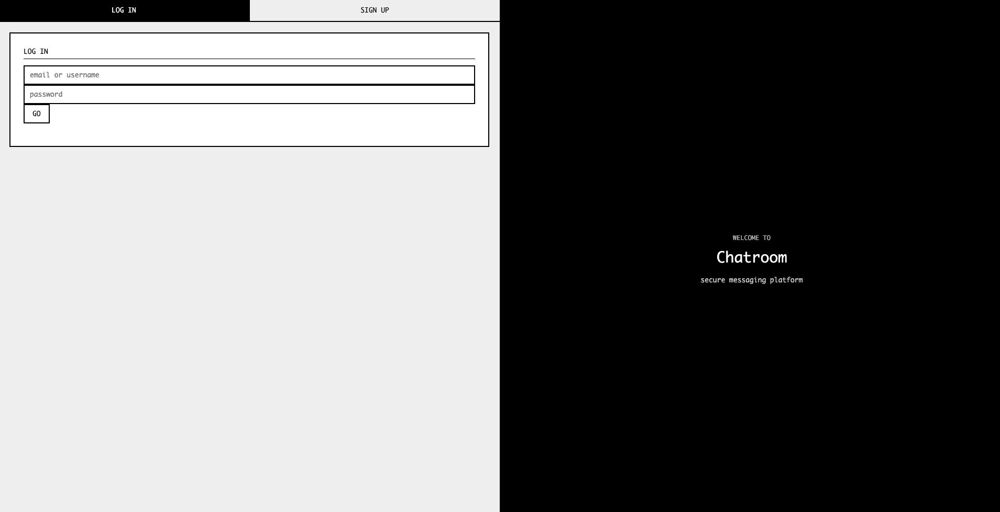
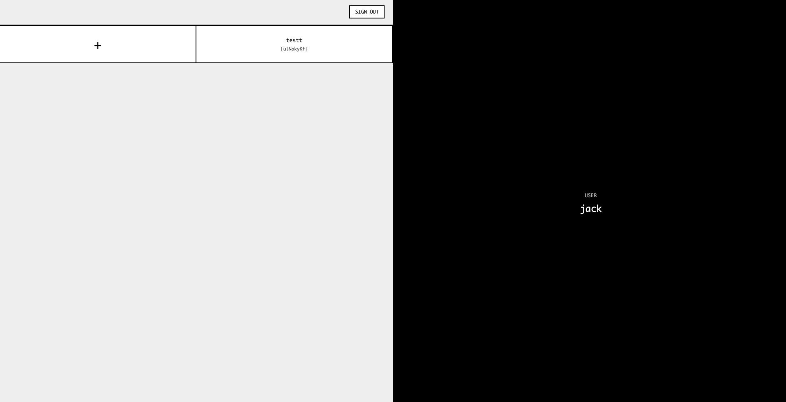
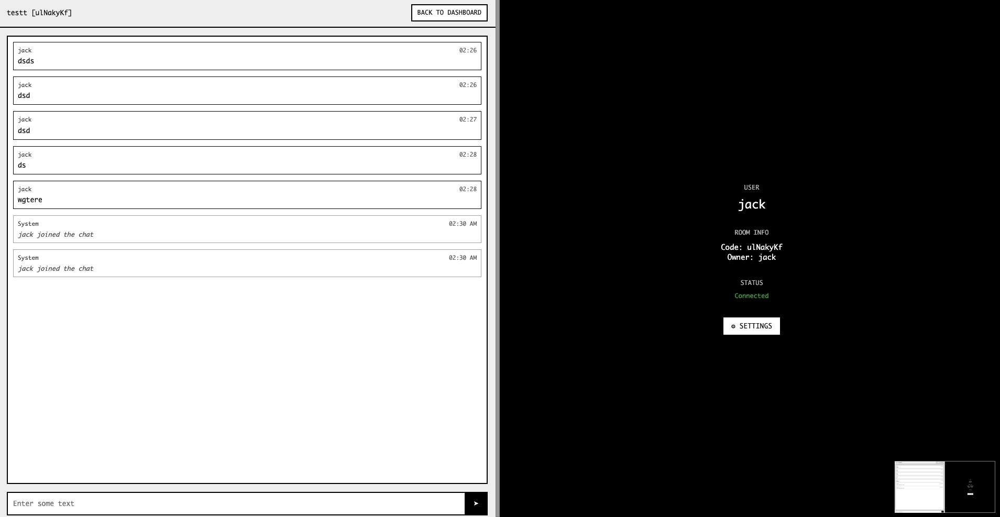

# Chatroom

A real-time chat application built with Go and WebSockets, featuring a retro terminal aesthetic. Users can create private chatrooms with secret codes and chat instantly with friends.

## Features

- User authentication with secure password hashing
- Create and join private chatrooms using secret codes
- Real-time messaging with WebSocket connections
- Room management (rename, delete, view members)
- Retro terminal-style UI with monospace fonts
- Responsive design for desktop and mobile

## Tech Stack

**Backend:**
- Go with Gin web framework
- SQLite database with GORM
- WebSocket connections for real-time chat
- bcrypt for password security

**Frontend:**
- Vanilla JavaScript
- CSS with custom terminal styling
- HTML templates

## Getting Started

1. Clone the repository
2. Install dependencies:
   ```bash
   go mod tidy
   ```
3. Run the application:
   ```bash
   go run *.go
   ```
4. Open your browser to `http://localhost:8080`

## Project Structure

```
chatroom/
├── main.go                 # Server setup and routing
├── handlers/               # HTTP request handlers
│   ├── auth.go            # Login/signup functionality
│   ├── chatroom.go        # Room creation and joining
│   ├── websocket.go       # Real-time messaging
│   └── room_management.go # Room settings and deletion
├── middleware/
│   └── auth.go            # Authentication middleware
├── models/
│   └── models.go          # Database models
├── templates/             # HTML pages
└── static/                # CSS and JavaScript files
```

## Usage

1. **Sign up** for a new account or log in
2. **Create a room** with a custom name and secret password
3. **Share the room code** with friends so they can join
4. **Start chatting** in real-time
5. **Manage your rooms** through the settings panel

## Database Schema

The application uses four main tables:
- **Users** - account information and authentication
- **Chatrooms** - room details and ownership
- **Messages** - chat messages with timestamps
- **Memberships** - user-room relationships

## Screenshots

### Login Page


### Dashboard


### Chat Room


## Notes

This project was built as a learning exercise to explore Go web development, WebSocket implementation, and real-time application architecture. The retro UI design is inspired by classic terminal interfaces.

The application handles user sessions in memory, which works well for development but would need Redis or similar for production use. Message history is persisted in SQLite and loaded when users join rooms.